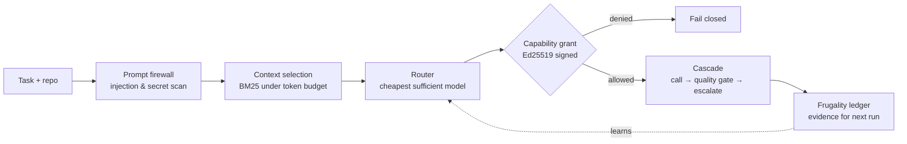

<p align="center">
  
</p>

# Seneschal: Local-First Control Layer for AI Work

[](https://github.com/SteveBlackbeard/SENESCHAL-by-Ethernium/actions/workflows/ci.yml)
[](https://pypi.org/project/seneschal/)
[](https://pypi.org/project/seneschal/)
[](https://github.com/SteveBlackbeard/SENESCHAL-by-Ethernium/blob/main/LICENSE)
[](https://www.python.org/downloads/release/python-3100/)
[](https://github.com/SteveBlackbeard/SENESCHAL-by-Ethernium/blob/main/pyproject.toml)
[-0a7bbb)](https://pypi.org/project/seneschal/#files)

#### Languages
[](https://github.com/SteveBlackbeard/SENESCHAL-by-Ethernium/blob/main/README.md) [](https://github.com/SteveBlackbeard/SENESCHAL-by-Ethernium/blob/main/OTHER_LANGUAGES/README_es.md) [](https://github.com/SteveBlackbeard/SENESCHAL-by-Ethernium/blob/main/OTHER_LANGUAGES/README_fr.md) [](https://github.com/SteveBlackbeard/SENESCHAL-by-Ethernium/blob/main/OTHER_LANGUAGES/README_de.md) [](https://github.com/SteveBlackbeard/SENESCHAL-by-Ethernium/blob/main/OTHER_LANGUAGES/README_it.md) [](https://github.com/SteveBlackbeard/SENESCHAL-by-Ethernium/blob/main/OTHER_LANGUAGES/README_pt.md) [](https://github.com/SteveBlackbeard/SENESCHAL-by-Ethernium/blob/main/OTHER_LANGUAGES/README_ja.md) [](https://github.com/SteveBlackbeard/SENESCHAL-by-Ethernium/blob/main/OTHER_LANGUAGES/README_zh.md) [](https://github.com/SteveBlackbeard/SENESCHAL-by-Ethernium/blob/main/OTHER_LANGUAGES/README_ko.md) [](https://github.com/SteveBlackbeard/SENESCHAL-by-Ethernium/blob/main/OTHER_LANGUAGES/README_ru.md) [](https://github.com/SteveBlackbeard/SENESCHAL-by-Ethernium/blob/main/OTHER_LANGUAGES/README_ar.md)

Seneschal by Ethernium is a local-first control layer for cheaper, safer AI-assisted work.

It helps decide what context to send, what to keep local, what to block, and whether a task deserves a stronger model. The goal is practical token economy: fewer whole-repo dumps, fewer retries, smaller prompts, safer tool scope, and clearer task packets.

## Measured, on real repositories

Not an estimate — counted with `tiktoken`, reproducible with the command below.

| Repository | Naive dump | Seneschal selection | Reduction |
| :--- | ---: | ---: | ---: |
| This repo (69 files) | 69,412 tokens | 8,236 tokens | **88.1%** |
| Chronolith Pro (109 files) | 109,978 tokens | 8,527 tokens | **92.2%** |

On a second run with nothing changed, context snapshots avoid **100%** of the resend.

```bash
python scripts/benchmark_savings.py --path . --objective "fix the signed capability grant verification logic"
```

**Not measured here:** cascade and routing savings. Those depend on live model
calls and accumulated ledger evidence, so any figure would be a guess — and this
project does not publish guesses as measurements.

## Architecture



## Product Objective

Seneschal's objective is to be the preflight and execution layer for AI work: reduce tokens, choose the cheapest sufficient provider, prefer local compute, block unsafe or wasteful calls, execute only when the plan is acceptable, and record enough evidence to improve the next run.

## What It Does

- estimates token budgets without locking into one provider
- packs repository context under an explicit model budget
- recommends the cheapest sufficient model path for a task
- snapshots context so unchanged files do not need to be resent
- estimates token-cost savings across repeated runs
- selects the most relevant neighboring context under a token budget
- dry-runs provider capacity routing without API keys or network calls
- scans untrusted text/files for prompt-injection and secret-like material
- creates scoped context packets for agents
- checks least-privilege capability grants
- records cost/retry/outcome data in a JSONL frugality ledger
- can execute planned calls through local Ollama and OpenAI-compatible adapters
- applies a cheap quality gate after model responses
- exposes terminal and optional MCP controls

## What It Is Not

Seneschal is not:

- a leaked-prompt archive
- a jailbreak toolkit
- a provider bypass tool
- a dashboard
- a database-backed agent platform
- a dependency of another project

The clean-room rule is simple: study economics and control patterns, then rebuild provider-neutral primitives. Do not copy proprietary prompts or hidden policies.

## Quick Start

```powershell
cd D:\Experimentos\ROBIN-HOOD
pip install -e .
seneschal health --strict
pytest -q
```

For a full operational walkthrough, see `USAGE.md`. For release gates, see `RELEASE.md`.

Inspect available model profiles:

```powershell
seneschal models
```

List provider profiles from a local catalog:

```powershell
copy providers.local.json.example providers.local.json
seneschal providers --providers providers.local.json
```

Create optional project defaults:

```powershell
copy seneschal.config.json.example seneschal.config.json
```

Check provider configuration without spending tokens:

```powershell
seneschal provider-health --providers providers.local.json
```

Record local provider state for circuit-breaker routing:

```powershell
seneschal provider-mark --provider ollama-local-code --status fail --reason timeout
seneschal provider-state
```

Estimate whether a file fits a model profile:

```powershell
seneschal budget --file README.md --model local-small
```

Pack a project into a smaller context budget:

```powershell
seneschal pack --path . --model local-long --max-tokens 12000
```

Render the included files as a text packet:

```powershell
seneschal pack --path . --model local-long --max-tokens 12000 --render
```

Recommend a route before spending stronger model budget:

```powershell
seneschal route --objective "Security review before release" --privacy cloud-allowed --max-escalation strong
```

Create a context cache and measure changed-only savings:

```powershell
seneschal snapshot --path .
```

Estimate how much of a prompt can be reused as stable/cacheable context:

```powershell
seneschal reuse --system "stable operating rules" --user "specific task"
```

Convert token savings into money:

```powershell
seneschal savings --full-tokens 28611 --optimized-tokens 6166 --input-cost-per-million 2 --runs 100
```

Or combine snapshot and ROI in one command:

```powershell
seneschal snapshot --path . --input-cost-per-million 2 --runs 100
```

Select changed files plus useful neighbors under a strict budget:

```powershell
seneschal select --path . --changed seneschal/cli.py --max-tokens 4000
```

Dry-run provider capacity routing:

```powershell
seneschal broker-dry-run --objective "Security review before release" --estimated-input-tokens 12000 --privacy local-first
```

Use a local provider catalog:

```powershell
seneschal broker-dry-run --providers providers.local.json --objective "Analyze repo" --estimated-input-tokens 8000
```

Avoid locally degraded providers:

```powershell
seneschal broker-dry-run --providers providers.local.json --state .seneschal/provider-state.json --objective "Analyze repo" --estimated-input-tokens 8000
```

Plan the request before any API call:

```powershell
seneschal plan-request --providers providers.local.json --state .seneschal/provider-state.json --objective "Analyze repo" --estimated-input-tokens 8000 --estimated-output-tokens 1200
```

Or use project defaults:

```powershell
seneschal plan-request --config seneschal.config.json --objective "Analyze repo" --estimated-input-tokens 8000
```

Run through the local Ollama adapter after planning:

```powershell
seneschal run --providers providers.local.json --objective "Summarize this repo" --path . --model llama3.1
```

## CLI

Current commands:

```text
seneschal health
seneschal models
seneschal providers
seneschal provider-health
seneschal provider-state
seneschal provider-mark
seneschal budget
seneschal pack
seneschal route
seneschal snapshot
seneschal reuse
seneschal savings
seneschal select
seneschal broker-dry-run
seneschal plan-request
seneschal run
seneschal cascade
seneschal packet
seneschal scan
seneschal grant
seneschal log
seneschal report
```

Examples:

```powershell
seneschal scan --path adversarial_cases --source web --fail-on-block
seneschal route --objective "Fix typo in docs" --context "small task"
seneschal snapshot --path .
seneschal packet --objective "Fix release docs" --allowed-file README.md --verify "pytest -q"
seneschal grant --task-id RH-001 --capability read --capability edit --allowed-path ROBIN-HOOD/ --action edit --path ROBIN-HOOD/README.md
seneschal log --task-id RH-002 --model local-small --tokens-estimated 900 --outcome pass --reduced cost
seneschal report
```

## Signed Capability Grants

An unsigned grant is a JSON file any process can edit — an agent could forge its
own permissions. With the `security` extra (`pip install -e ".[security]"`),
grants become cryptographic guarantees:

```powershell
seneschal keygen
seneschal grant --sign --task-id RH-001 --capability read --allowed-path src/ --expires 2026-12-31T00:00:00+00:00 --out grant.json
seneschal grant --grant-file grant.json --require-signed --action read --path src/main.py
```

The broker fails closed on: missing or invalid signatures, grants re-signed by
an untrusted key, any modification after signing (capability escalation), and
expired grants. `sig_alg` is carried on every signed document so a post-quantum
signer can drop in later without a format break.

A third party who has only the signed grant (not your keypair) can verify it by
pinning the operator's **key fingerprint**, published out of band (shown by
`keygen`), and a grant is bound to its task so it cannot be replayed elsewhere:

```powershell
seneschal grant --grant-file grant.json --expect-fingerprint "SHA256:..." --task-id RH-001 --action read --path src/main.py
```

## Frugal Cascade And Learning Router

`seneschal cascade` implements the FrugalGPT pattern: call the cheapest
sufficient model, apply the quality gate, and escalate only on failure — every
hop is recorded in the frugality ledger as evidence:

```powershell
seneschal cascade --objective "Summarize this repo" --path . --providers providers.local.json --ledger seneschal-usage.jsonl
```

`seneschal route --explore` upgrades routing from static penalties to a
Thompson-sampling bandit: each model's Beta posterior is built from ledger
outcomes, so the router exploits reliable models and keeps exploring
under-observed ones (`--seed` makes exploration reproducible).

`seneschal select --objective "..."` ranks candidate context files with Okapi
BM25 relevance to the task on top of the structural heuristics, and
`seneschal reuse --layout` emits a provider prompt-caching plan (stable prefix
first, cacheable ratio, and the money a naive layout leaves on the table).

## Frugality Core

Seneschal currently uses explicit provider profiles:

```text
local-small
local-long
openai-compatible-balanced
anthropic-compatible-long
generic-local-lora
```

The default tokenizer is an honest fallback estimate. That is deliberate: the tool should work before provider SDKs, API keys, local servers, or tokenizer packages are installed. Later adapters can add measured tokenizers without changing the command surface.

Private provider catalogs should live in `providers.local.json`. That file is ignored by Git. Use `providers.local.json.example` as a safe template and keep real endpoints, key names, quotas, and enabled providers local.

Project defaults can live in `seneschal.config.json`. That file is ignored by Git. Use `seneschal.config.json.example` as the safe template.

Experimental local models, including abliterated variants, can be represented as disabled provider profiles in `providers.local.json`. Seneschal treats them as local compute, not as privileged bypass tools. Keep them disabled until you explicitly need them, run `seneschal scan` on external prompts, run `seneschal plan-request` before use, and keep human review on outputs that affect code, security, legal, medical, finance, or public release decisions.

`seneschal provider-health` checks only local configuration. It verifies enabled/disabled state and required environment variables, but does not call remote APIs or run inference. This keeps readiness cheap, deterministic, and safe to run inside Cursor, VS Code, CI, or an MCP client before any model spend happens.

`seneschal provider-mark` and `seneschal provider-state` implement a small local circuit breaker. If a provider times out, hits quota, rate-limits, or should be disabled, Seneschal can remember that in `.seneschal/provider-state.json` and the broker can avoid that route before spending more tokens.

`seneschal plan-request` is the final preflight gate before a real adapter call. It combines broker routing, provider readiness, circuit-breaker state, fallback candidates, and estimated input/output cost. It still does not call APIs; it tells a caller whether the request should proceed.

`seneschal run` currently supports Ollama/local and OpenAI-compatible adapters. It still plans first, then calls the selected provider only if there are no blockers. Failed calls and quality failures are written to provider state so later plans can avoid degraded routes.

The quality gate is deliberately cheap: empty answers, very short answers, evasions, risky generated text, and low overlap with the objective are flagged before a run is considered successful.

## Integration

Seneschal can run from:

- terminal
- VS Code tasks
- Cursor rules
- MCP clients
- any workflow that can call a Python CLI

Integration scaffolds live in:

```text
integrations/vscode/tasks.json
integrations/cursor/rules/seneschal.mdc
integrations/mcp/server_contract.json
```

Optional MCP server:

```powershell
pip install -e .[mcp]
seneschal-mcp
```

MCP tools expose local controls for health, prompt scanning, context packets, capability checks, model profiles, provider health, provider state, token budgets, context packing, context snapshots, prompt reuse estimates, and routing.
Routing is exposed as a recommendation only; Seneschal still does not invoke models.

## Compatibility With Continuity Legacy

Seneschal is compatible with Continuity Legacy, but does not require it.

The intended relationship is:

- Continuity Legacy governs repository integrity, baselines, release gates, and handoff discipline.
- Seneschal governs token economy, context packing, prompt-risk scanning, model selection, and agent operations.

They are designed to work beside each other. Neither should be embedded inside the other.

## Compatibility Note

The internal Python package is still named `seneschal` for compatibility with the incubation prototype. The public product name is Seneschal.

Backward-compatible console aliases remain available:

```text
seneschal
seneschal-mcp
```

Prefer the public commands:

```text
seneschal
seneschal-mcp
```

## Status

```text
status: prototype
safe_to_extract: true
runtime_dependencies: none
optional_dependencies: mcp
```

Seneschal is useful today as a local frugality and safety tool. It is not yet a provider router or model invocation layer.
